## 
 जय श्री कृष्णा 
-----------
# 
<i><b>INTRODUCING DIVINE GITA GYAN WEB APP</i> 

In this project, I have  developed  "Divine Gita Gyan web app" using react.js  in which multipage routing is implemented using React-Router library. 
Purpose of developing Sri Bhagavad Gita web app is to make the entire divine knowledge of "Srimad bhagavad Gita" accessible to every human being in less time and easily.

### <b>Srimad Bhagavad Gita</b> is the Divine Discourse spoken by supreme lord sri Krishna himself.
- Chapters and verses of "Srimad bhagavad gita" is the Ultimate guide for successful life and humanity.

- There is no question of life that is not answered in <i>Srimad Bhagavad Gita</i>

----
## Web App Live Link for using : <a style="text-decoration:none" href="https://divine-gita-gyan.web.app/">Divine Gita Gyan </a>
  

## Web App Contains
-----
- About Srimad bhagavad gita in easy hindi language
- Well written Summaries of  18 chapters of Srimad bhagavad gita in english and hindi language.
- Each chapters contains list of verses/sloks with its Word meanings, English and Hindi Translations and commentaries by devotional authors in easy- understandable way.

----

## Screenshots
____
In Desktop Devices:
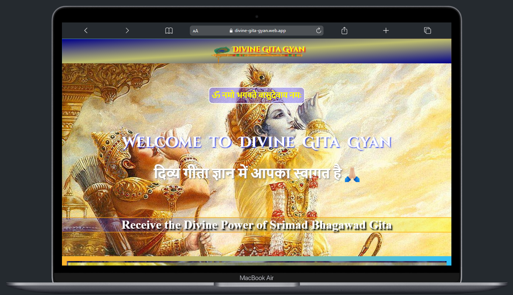
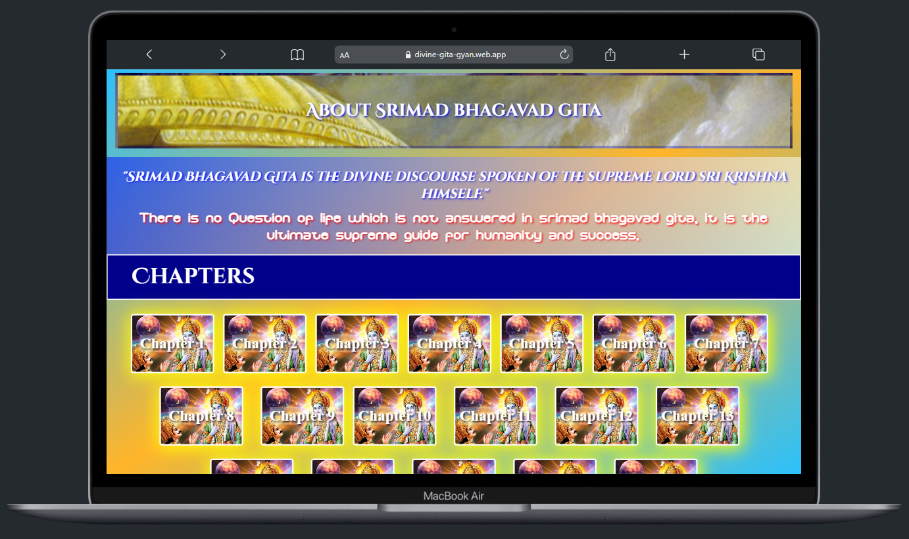
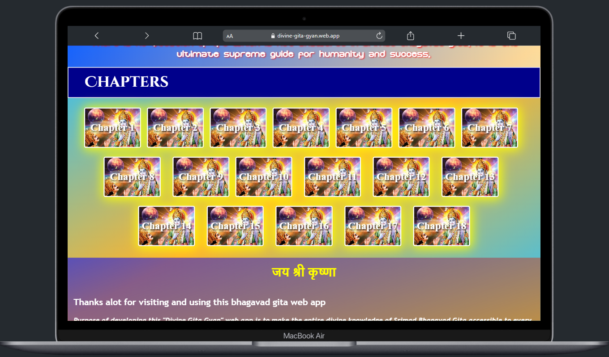
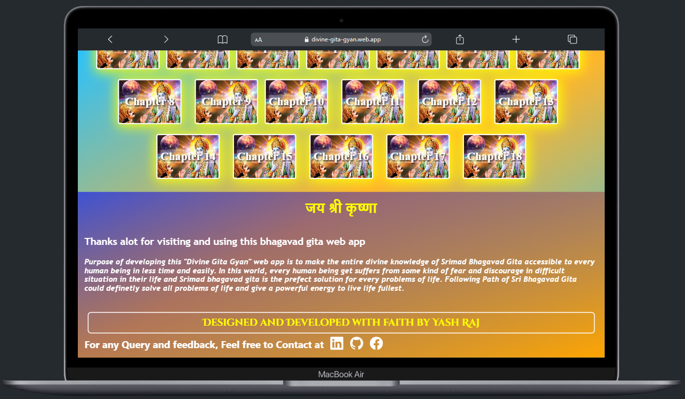
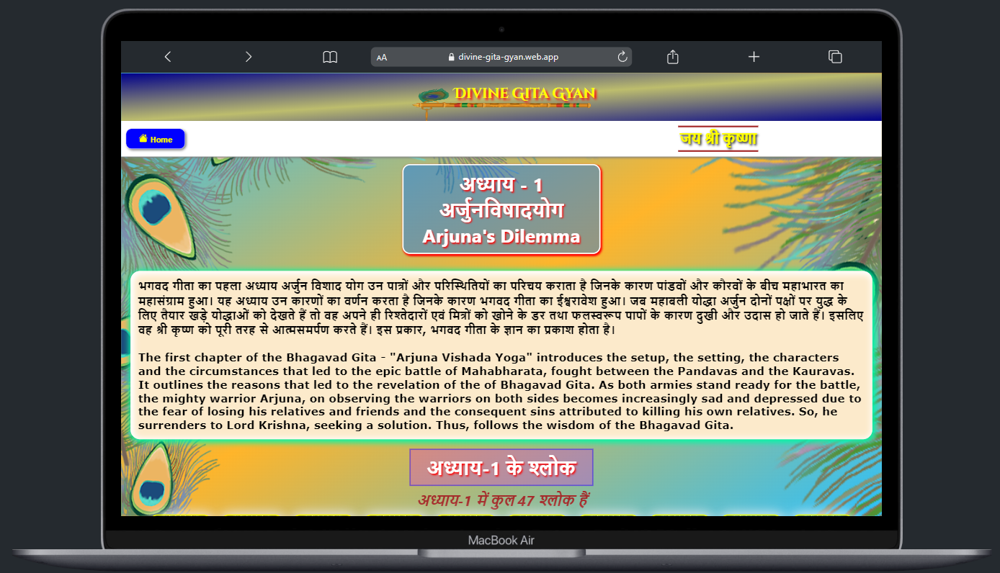
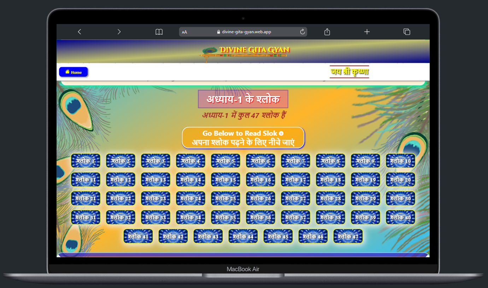
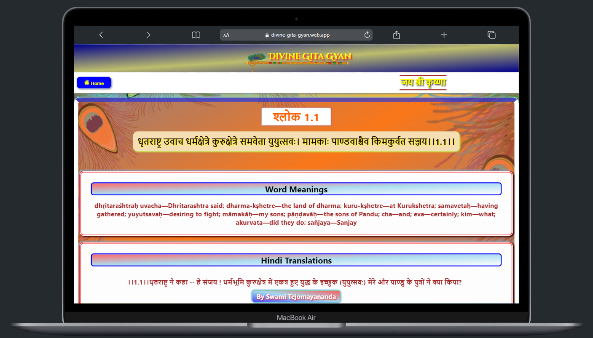

In MobileDevices:

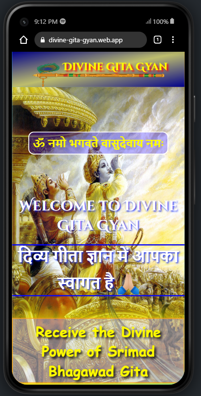

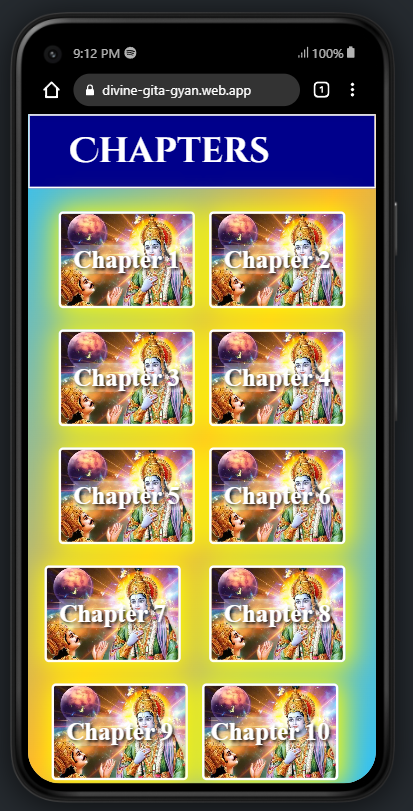
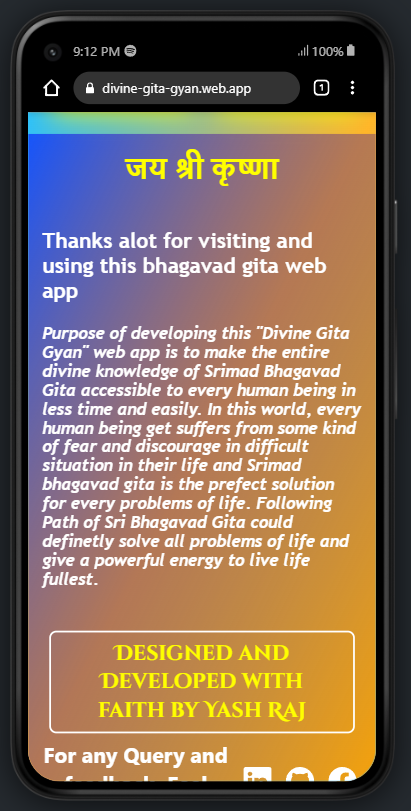
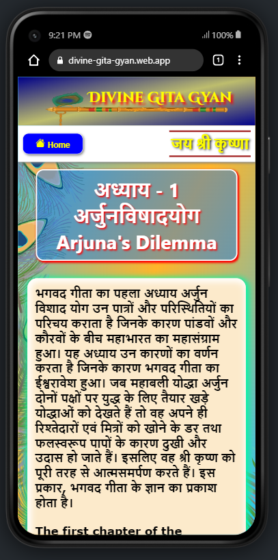
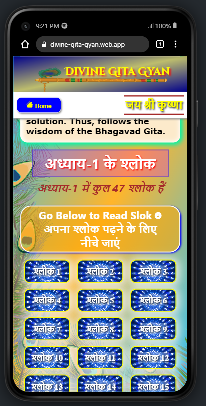
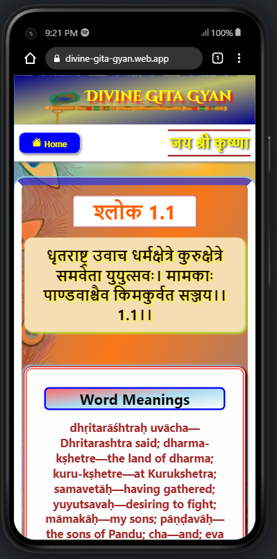

## Technology Used
___

- React.js
- React-Router-Dom 

